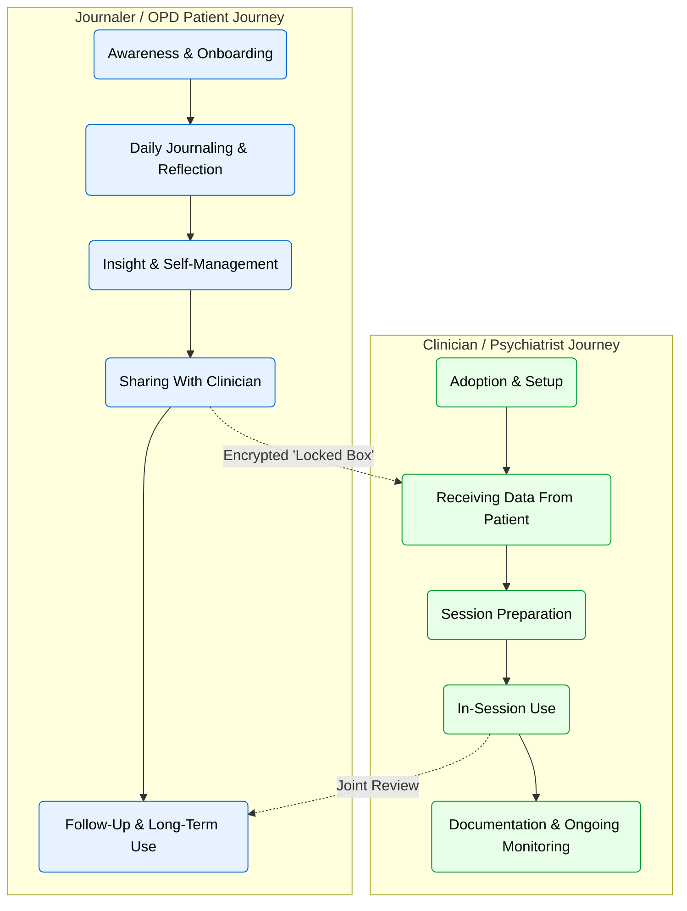

# Anora: Zero-Knowledge Mental Wellness App - Architecture & Journey Maps

## 1. User Journey Maps

This section outlines the parallel journeys of the Patient (Journaler) and the Clinician, highlighting key interactions, emotions, and privacy touchpoints.

### Detailed Journey Breakdown

#### Persona 1: Journaler / OPD Patient

| Stage | Actions | Touchpoints | Emotions | Opportunities |
| :--- | :--- | :--- | :--- | :--- |
| **Awareness & Onboarding** | Discovers Anora, reads about privacy, installs app, completes onboarding. | App store, Privacy explainer, Onboarding flow. | Skeptical → Reassured → Hopeful | Clearer reassurance about 'no cloud data', simple AI explanation. |
| **Daily Journaling & Reflection** | Writes entries, uses prompts, checks mood summaries. | Editor screen, Mood chips, Analysis card. | Relief, Curiosity, Anxiety (if negative trends) | Gentle language around "risk", positive reinforcement. |
| **Insight & Self-Management** | Views trends, reads pattern explanations, explores coping resources. | Insights dashboard, Streaks, Resource links. | Understood, Confronted | Simplify visualizations, "tiny wins" feedback, crisis resources. |
| **Sharing With Clinician** | Opts to share summary, selects time range, previews summary. | "Share with clinician" flow, Encryption progress. | Cautious → Trusting → Empowered | Show exactly what is being shared; reassure raw text stays local. |
| **Follow-Up & Long-Term Use** | Updates journals, tracks changes, pauses usage. | Long-term trend view, Reminders. | Stable, In control, Disengaged | Non-guilting re-engagement nudges, graduation ritual. |

#### Persona 2: Clinician / Psychiatrist

| Stage | Actions | Touchpoints | Emotions | Opportunities |
| :--- | :--- | :--- | :--- | :--- |
| **Adoption & Setup** | Signs up, verifies identity, generates keypair. | Clinician onboarding, Keypair setup. | Cautious, Curious, Time-poor | Short setup, clear legal/privacy framing, sample reports. |
| **Receiving Data** | Receives notification, downloads locked box, decrypts summary. | Patient list, New-report badge, Report viewer. | Interested, Skeptical, Impressed | One-click "review before session", flag key changes. |
| **Session Preparation** | Reviews timeline, risk flags, sleep/anxiety indicators. | Per-patient timeline, Risk highlights. | Better prepared, Less blind-spotted | Add clinician notes/hypotheses, quick filters. |
| **In-Session Use** | Refers to summary, checks indicators, reviews trends with patient. | Tablet/Laptop view, Shared screen. | Collaborative, Cautious | Tools to mark "clinically relevant" events, override misclassifications. |
| **Documentation** | Writes notes, sets alert thresholds, decides on future reports. | Alert settings, EHR integration, Export summary. | Supported, Concerned (liability) | Configurable alerts, audit trail, clear 'AI is assistive' messaging. |

> **Note:**
> *   All raw text stays on the patient device – clinicians see only derived scores/summaries.
> *   AI is assistive, not diagnostic.

## 2. Data Journey Diagram

This diagram illustrates the lifecycle of user data, focusing on on-device processing, end-to-end encryption, and privacy-preserving federated learning.

```mermaid
flowchart LR
    %% Styles
    classDef raw fill:#ffe6e6,stroke:#ff0000,stroke-width:2px,color:#000
    classDef enc fill:#e6f2ff,stroke:#0000ff,stroke-width:2px,color:#000
    classDef ml fill:#e6ffe6,stroke:#008000,stroke-width:2px,color:#000
    classDef sec fill:#fff3cd,stroke:#e0a800,stroke-width:2px,stroke-dasharray: 5 5,color:#000
    classDef infra fill:#f5f5f5,stroke:#666,stroke-width:1px,color:#000

    %% Swimlanes
    subgraph UserDevice ["User Device (Mobile App)"]
        direction TB
        
        %% Nodes
        UserEntry([User types journal entry])
        PreProc[Local Pre-processing<br/>Tokenization, Filters]
        
        subgraph Inference ["Local AI Engine"]
            ModelInf[On-device AI Inference<br/>Quantized MentalBERT + Adapter]
        end
        
        Outputs[/Output: Mood, Risk, Themes/]
        
        LocalStore[(Local Encrypted Store<br/>SQLite/Realm + AES)]
        Analytics[Local Analytics Cache<br/>Numeric trends only]
        
        KeyMgmt{{Key Management<br/>Secure Enclave / Keystore}}
        
        %% Care Loop Nodes
        GenSum[Generate Clinical Summary JSON]
        GenAES[Create One-time AES Key]
        EncJSON[Encrypt JSON w/ AES]
        EncKey[Encrypt AES Key w/ Dr Public Key]
        LockedBox[Package 'Locked Box'<br/>Encr. Payload + Encr. Key]
        
        %% Learning Loop Nodes
        LocalTrain[Local Training<br/>Embeddings + Labels]
        CalcGrad[Compute Gradients]
        MaskGrad[Apply SecAgg Mask<br/>Masked Gradients]
        
        PrivacyGuard{Privacy Guard Layer<br/>Blocks Raw Text}
    end

    subgraph Cloud ["Cloud Backend"]
        Mailman[Blind Mailman API<br/>Opaque Blob Storage]
        SecAggService[Secure Aggregation Service<br/>Combines Masks]
        AggModel[Aggregate Updates<br/>Global Average]
        ModelDist[Model Distribution Service]
    end

    subgraph Doctor ["Doctor Device"]
        DocDownload[Download Locked Box]
        DecryptK[Decrypt AES Key<br/>Uses Dr Private RSA Key]
        DecryptJ[Decrypt JSON Payload]
        Dashboard[Render Clinical Dashboard<br/>Timeline & Risk Flags]
    end

    subgraph Infra ["Model Training Infra"]
        UpdateGlobal[Update Global Base Model]
    end

    %% Connections: Journaling Flow
    UserEntry:::raw --> PreProc:::raw
    PreProc --> ModelInf:::ml
    ModelInf --> Outputs:::ml
    Outputs --> LocalStore:::enc
    Outputs --> Analytics:::ml
    KeyMgmt:::sec -.-> LocalStore
    
    %% Connections: Doctor Reporting (Care Loop)
    Analytics --> GenSum:::ml
    GenSum --> EncJSON:::enc
    GenAES:::sec --> EncJSON
    GenAES --> EncKey:::enc
    EncJSON --> LockedBox:::enc
    EncKey --> LockedBox
    
    LockedBox --> PrivacyGuard:::sec
    PrivacyGuard -- "Encrypted Blob" --> Mailman:::enc
    
    Mailman --> DocDownload:::enc
    DocDownload --> DecryptK:::sec
    DecryptK --> DecryptJ:::enc
    DecryptJ --> Dashboard:::ml

    %% Connections: Federated Learning (Learning Loop)
    LocalStore --> LocalTrain:::ml
    LocalTrain --> CalcGrad:::ml
    CalcGrad --> MaskGrad:::ml
    
    MaskGrad --> PrivacyGuard
    PrivacyGuard -- "Masked Gradients" --> SecAggService:::ml
    
    SecAggService --> AggModel:::ml
    AggModel --> UpdateGlobal:::ml
    UpdateGlobal --> ModelDist:::infra
    ModelDist -- "Updated Base Model" --> UserDevice

    %% Styling Application
    class UserEntry,PreProc raw
    class LocalStore,LockedBox,Mailman,DocDownload,EncJSON,EncKey,DecryptJ enc
    class ModelInf,Outputs,Analytics,GenSum,LocalTrain,CalcGrad,MaskGrad,SecAggService,AggModel,UpdateGlobal,Dashboard ml
    class KeyMgmt,PrivacyGuard,GenAES,DecryptK sec
```

## 3. Diagram Analysis & Flow Descriptions

### A. User Device Lane (The Trust Boundary)

Everything within this lane is considered the "Trusted Zone." Raw PHI (Protected Health Information) exists here transiently in memory but is never persisted or transmitted without transformation.

**Ingestion & Inference:**

*   **Input:** User types raw text.
*   **Processing:** Text is tokenized locally. A quantized MentalBERT model (optimized for mobile) runs inference.
*   **Result:** Derived signals (Mood score, Risk flags, DSM-5 proxies).

**Storage:**

*   **Journal Store:** Raw text and metadata are stored in a local database (SQLite/Realm) encrypted with AES-256. Keys are managed by the device's hardware-backed keystore (Secure Enclave).
*   **Analytics Cache:** Stores only derived numeric data (e.g., "Anxiety Score: 7/10") to speed up dashboard rendering without decrypting text.

**Privacy Guard:**

A software interceptor that acts as a firewall. It strictly forbids any HTTP request containing strings that match the raw text format. It only permits outbound traffic that validates as "Encrypted Blob" or "Masked Numeric Vector."

### B. The Care Loop (Doctor Reporting)

This flow utilizes Hybrid Encryption (PGP-style logic) to allow doctors to see data without the server seeing it.

*   **Packaging:** The app generates a JSON summary of trends/risks. It generates a random, one-time AES key to encrypt this large JSON.
*   **Key Exchange:** The app fetches the Doctor's Public RSA Key (certified) and encrypts the one-time AES key.
*   **The "Locked Box":** The encrypted JSON and the encrypted Key are bundled.
*   **Transport:** The "Locked Box" is sent to the Blind Mailman API. The server sees only a blob of bytes. It cannot read the contents.
*   **Decryption:** The doctor's device uses their Private Key (stored only on their device/YubiKey) to unlock the AES key, then unlocks the clinical data.

### C. The Learning Loop (Federated Learning)

This flow ensures the AI improves without centralizing user data.

*   **Local Training:** When the phone is charging/idle, the app fine-tunes the model on local journal entries.
*   **Gradient Calculation:** The app calculates "gradients" (mathematical directions to improve the model).
*   **Secure Aggregation (SecAgg+):** Before sending, the gradients are masked using a cryptographic protocol where the server adds up inputs from 1,000 users. The masks mathematically cancel each other out only when summed, revealing the global average but hiding individual contributions.
*   **Global Update:** The server updates the base model and distributes version v2.0 back to all phones.

## 4. Data Classification Legend

| Border Color | Classification | Definition | Flow Constraints |
| :--- | :--- | :--- | :--- |
| **Red** | Raw PHI Text | The user's actual journal words. | NEVER leaves the User Device. |
| **Green** | ML/Derived | Mathematical representations, scores, or vectors. | Can leave device only if Masked (for FL) or Encrypted (for Doctor). |
| **Blue** | Encrypted | Data wrapped in AES/RSA encryption. | Can be stored on Server (Blind Mailman) or transmitted freely. |
| **Yellow** | Security | Keys, Guards, and Policy layers. | Keys generated on-device never leave the device. |
