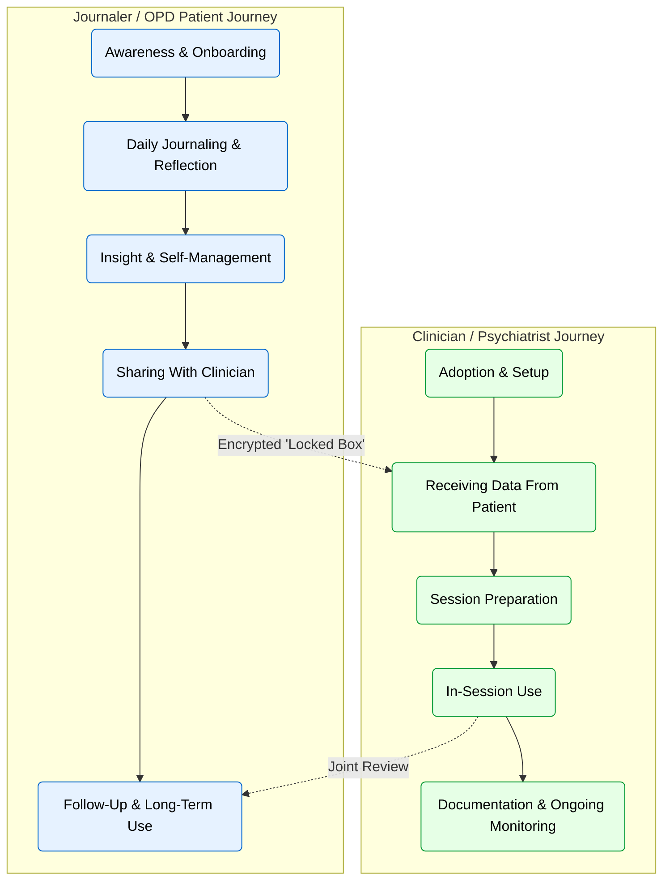

# Anora: Zero-Knowledge Mental Wellness App

## Current Status (May 2026)

🚀 **Production Ready - Beta Launch** | ✅ All core infrastructure deployed to AWS App Runner

**Latest Update:** Federated learning infrastructure live and operational. Blind Mailman encrypted reporting functional end-to-end. Local training uses lightweight head fine-tuning (real tokenizer integration in v2.1 roadmap).

**Live Endpoints:**
- API: https://xydctnf6j6.us-east-1.awsapprunner.com
- Health: `/health` (active DB connectivity check)
- FL Dashboard: `/fl/dashboard/overview` (admin monitoring)

**For Deployment Details:** See `DEPLOYMENT_VERIFICATION_GUIDE.md` and `RELEASE_BUILD_GUIDE.md`

### What Changed in May 2026

| Change | Reasoning | Impact |
| :--- | :--- | :--- |
| **AWS App Runner Deployment** | Managed container service better suited to mobile backend workload than GCP Cloud Run | Updated backend sections from GCP references to AWS |
| **Database Init Script (`init_prod_db.py`)** | Manual migrations error-prone; need repeatable, idempotent initialization | Simplifies first-time database setup in production |
| **Environment Template (`.env.production.template`)** | Previous docs scattered env vars across multiple files | Single reference point for all required/optional configuration |
| **Health Check Enhancement** | DB_READY flag only indicates past initialization; doesn't catch current outages | Active `SELECT 1` test on every health check call |
| **CORS Default Lockdown** | Security improvement: was open to all origins ("*") | Now defaults to CloudFront CDN; configurable via ALLOWED_ORIGINS env var |
| **Release Build Correction** | APK was built with CloudFront CDN URL instead of App Runner API URL | Documented correct build command; Flutter app now points to actual backend |
| **FL Infrastructure Completion** | Federated learning roadmap feature finished | Client registration, gradient submission, aggregation, dashboard all live |
| **Deployment Guides** | No central reference for going live | Created `DEPLOYMENT_VERIFICATION_GUIDE.md` and `RELEASE_BUILD_GUIDE.md` |

---

## High-level Overview
Anora is a privacy-first mental wellness journaling application that leverages on-device AI to provide clinical-grade insights without compromising user data. By processing all sensitive text locally and using federated learning for model improvement, Anora bridges the gap between personal self-reflection and professional clinical care, offering DSM-5 aligned indicators while ensuring zero-knowledge privacy.

### Key Features
*   **Secure Journaling:** AES-256 encrypted local storage for all entries.
*   **On-Device AI:** Real-time emotional analysis and risk detection using quantized MentalBERT.
*   **Federated Learning:** Privacy-preserving model updates without sharing raw data.
*   **Clinician "Locked Box":** Cryptographically secure reporting mechanism for sharing insights with therapists.
*   **Zero-Knowledge Architecture:** No raw text ever leaves the user's device.

## Architecture & Tech Stack
Anora follows a "Local-First" architecture. The mobile app handles all data ingestion, storage, and inference. The backend acts as a "Blind Mailman" for encrypted reports and a coordinator for Secure Aggregation (SecAgg) of model gradients.

*   **Mobile:** Flutter (UI), TFLite (Inference), Hive/SQLite (Storage), flutter_secure_storage (Key management).
*   **Backend:** Python/FastAPI (Coordinator), PostgreSQL (Metadata), Redis (Message Queue).
*   **AI/ML:** MentalBERT (Base Model), TensorFlow Federated (TFF), TFLite (Quantization).
*   **Design Principles:** Zero-Knowledge, Least Privilege, Local-First, No Telemetry by Default.

## 1. User Journey Maps

This section outlines the parallel journeys of the Patient (Journaler) and the Clinician, highlighting key interactions, emotions, and privacy touchpoints.


```mermaid
flowchart TB
    %% Swimlanes
    subgraph Patient ["Journaler / OPD Patient Journey"]
        direction TB
        P1(Awareness & Onboarding) --> P2(Daily Journaling & Reflection)
        P2 --> P3(Insight & Self-Management)
        P3 --> P4(Sharing With Clinician)
        P4 --> P5(Follow-Up & Long-Term Use)
    end

    subgraph Clinician ["Clinician / Psychiatrist Journey"]
        direction TB
        C1(Adoption & Setup) --> C2(Receiving Data From Patient)
        C2 --> C3(Session Preparation)
        C3 --> C4(In-Session Use)
        C4 --> C5(Documentation & Ongoing Monitoring)
    end

    %% Interactions
    P4 -.->|"Encrypted 'Locked Box'"| C2
    C4 -.->|"Joint Review"| P5

    %% Styling
    classDef patient fill:#e6f2ff,stroke:#0066cc,color:black
    classDef clinician fill:#e6ffe6,stroke:#009933,color:black
    classDef shared fill:#f3e6ff,stroke:#6600cc,stroke-dasharray: 5 5,color:black

    class P1,P2,P3,P4,P5 patient
    class C1,C2,C3,C4,C5 clinician
```

### Detailed Journey Breakdown

#### Persona 1: Journaler / OPD Patient

| Stage | Actions | Touchpoints | Emotions | Opportunities |
| :--- | :--- | :--- | :--- | :--- |
| **Awareness & Onboarding** | Discovers Anora, reads about privacy, installs app, completes onboarding. | App store, Privacy explainer, Onboarding flow. | Skeptical → Reassured → Hopeful | Clearer reassurance about 'no cloud data', simple AI explanation. |
| **Daily Journaling & Reflection** | Writes entries, uses prompts, checks mood summaries. | Editor screen, Mood chips, Analysis card. | Relief, Curiosity, Anxiety (if negative trends) | Gentle language around "risk", positive reinforcement. |
| **Insight & Self-Management** | Views trends, reads pattern explanations, explores coping resources. | Insights dashboard, Streaks, Resource links. | Understood, Confronted | Simplify visualizations, "tiny wins" feedback, crisis resources. |
| **Sharing With Clinician** | Opts to share summary, selects time range, previews summary. | "Share with clinician" flow, Encryption progress. | Cautious → Trusting → Empowered | Show exactly what is being shared; reassure raw text stays local. |
| **Follow-Up & Long-Term Use** | Updates journals, tracks changes, pauses usage. | Long-term trend view, Reminders. | Stable, In control, Disengaged | Non-guilting re-engagement nudges, graduation ritual. |

#### Persona 2: Clinician / Psychiatrist

| Stage | Actions | Touchpoints | Emotions | Opportunities |
| :--- | :--- | :--- | :--- | :--- |
| **Adoption & Setup** | Signs up, verifies identity, generates keypair. | Clinician onboarding, Keypair setup. | Cautious, Curious, Time-poor | Short setup, clear legal/privacy framing, sample reports. |
| **Receiving Data** | Receives notification, downloads locked box, decrypts summary. | Patient list, New-report badge, Report viewer. | Interested, Skeptical, Impressed | One-click "review before session", flag key changes. |
| **Session Preparation** | Reviews timeline, risk flags, sleep/anxiety indicators. | Per-patient timeline, Risk highlights. | Better prepared, Less blind-spotted | Add clinician notes/hypotheses, quick filters. |
| **In-Session Use** | Refers to summary, checks indicators, reviews trends with patient. | Tablet/Laptop view, Shared screen. | Collaborative, Cautious | Tools to mark "clinically relevant" events, override misclassifications. |
| **Documentation** | Writes notes, sets alert thresholds, decides on future reports. | Alert settings, EHR integration, Export summary. | Supported, Concerned (liability) | Configurable alerts, audit trail, clear 'AI is assistive' messaging. |

> **Note:**
> *   All raw text stays on the patient device – clinicians see only derived scores/summaries.
> *   AI is assistive, not diagnostic.

## 2. Data Journey Diagram

This diagram illustrates the lifecycle of user data, focusing on on-device processing, end-to-end encryption, and privacy-preserving federated learning.


```mermaid
flowchart LR
    %% Styles
    classDef raw fill:#ffe6e6,stroke:#ff0000,stroke-width:2px,color:#000
    classDef enc fill:#e6f2ff,stroke:#0000ff,stroke-width:2px,color:#000
    classDef ml fill:#e6ffe6,stroke:#008000,stroke-width:2px,color:#000
    classDef sec fill:#fff3cd,stroke:#e0a800,stroke-width:2px,stroke-dasharray: 5 5,color:#000
    classDef infra fill:#f5f5f5,stroke:#666,stroke-width:1px,color:#000

    %% Swimlanes
    subgraph UserDevice ["User Device (Mobile App)"]
        direction TB
        
        %% Nodes
        UserEntry([User types journal entry])
        PreProc[Local Pre-processing<br/>Tokenization, Filters]
        
        subgraph Inference ["Local AI Engine"]
            ModelInf[On-device AI Inference<br/>Quantized MentalBERT + Adapter]
        end
        
        Outputs[/Output: Mood, Risk, Themes/]
        
        LocalStore[(Local Encrypted Store<br/>SQLite/Realm + AES)]
        Analytics[Local Analytics Cache<br/>Numeric trends only]
        
        KeyMgmt{{Key Management<br/>Secure Enclave / Keystore}}
        
        %% Care Loop Nodes
        GenSum[Generate Clinical Summary JSON]
        GenAES[Create One-time AES Key]
        EncJSON[Encrypt JSON w/ AES]
        EncKey[Encrypt AES Key w/ Dr Public Key]
        LockedBox[Package 'Locked Box'<br/>Encr. Payload + Encr. Key]
        
        %% Learning Loop Nodes
        LocalTrain[Local Training<br/>Embeddings + Labels]
        CalcGrad[Compute Gradients]
        MaskGrad[Apply SecAgg Mask<br/>Masked Gradients]
        
        PrivacyGuard{Privacy Guard Layer<br/>Blocks Raw Text}
    end

    subgraph Cloud ["Cloud Backend"]
        Mailman[Blind Mailman API<br/>Opaque Blob Storage]
        SecAggService[Secure Aggregation Service<br/>Combines Masks]
        AggModel[Aggregate Updates<br/>Global Average]
        ModelDist[Model Distribution Service]
    end

    subgraph Doctor ["Doctor Device"]
        DocDownload[Download Locked Box]
        DecryptK[Decrypt AES Key<br/>Uses Dr Private RSA Key]
        DecryptJ[Decrypt JSON Payload]
        Dashboard[Render Clinical Dashboard<br/>Timeline & Risk Flags]
    end

    subgraph Infra ["Model Training Infra"]
        UpdateGlobal[Update Global Base Model]
    end

    %% Connections: Journaling Flow
    UserEntry:::raw --> PreProc:::raw
    PreProc --> ModelInf:::ml
    ModelInf --> Outputs:::ml
    Outputs --> LocalStore:::enc
    Outputs --> Analytics:::ml
    KeyMgmt:::sec -.-> LocalStore
    
    %% Connections: Doctor Reporting (Care Loop)
    Analytics --> GenSum:::ml
    GenSum --> EncJSON:::enc
    GenAES:::sec --> EncJSON
    GenAES --> EncKey:::enc
    EncJSON --> LockedBox:::enc
    EncKey --> LockedBox
    
    LockedBox --> PrivacyGuard:::sec
    PrivacyGuard -- "Encrypted Blob" --> Mailman:::enc
    
    Mailman --> DocDownload:::enc
    DocDownload --> DecryptK:::sec
    DecryptK --> DecryptJ:::enc
    DecryptJ --> Dashboard:::ml

    %% Connections: Federated Learning (Learning Loop)
    LocalStore --> LocalTrain:::ml
    LocalTrain --> CalcGrad:::ml
    CalcGrad --> MaskGrad:::ml
    
    MaskGrad --> PrivacyGuard
    PrivacyGuard -- "Masked Gradients" --> SecAggService:::ml
    
    SecAggService --> AggModel:::ml
    AggModel --> UpdateGlobal:::ml
    UpdateGlobal --> ModelDist:::infra
    ModelDist -- "Updated Base Model" --> UserDevice

    %% Styling Application
    class UserEntry,PreProc raw
    class LocalStore,LockedBox,Mailman,DocDownload,EncJSON,EncKey,DecryptJ enc
    class ModelInf,Outputs,Analytics,GenSum,LocalTrain,CalcGrad,MaskGrad,SecAggService,AggModel,UpdateGlobal,Dashboard ml
    class KeyMgmt,PrivacyGuard,GenAES,DecryptK sec
```

## 3. Diagram Analysis & Flow Descriptions

### A. User Device Lane (The Trust Boundary)

Everything within this lane is considered the "Trusted Zone." Raw PHI (Protected Health Information) exists here transiently in memory but is never persisted or transmitted without transformation.

**Ingestion & Inference:**

*   **Input:** User types raw text.
*   **Processing:** Text is tokenized locally. A quantized MentalBERT model (optimized for mobile) runs inference.
*   **Result:** Derived signals (Mood score, Risk flags, DSM-5 proxies).

**Storage:**

*   **Journal Store:** Raw text and metadata are stored in a local database (SQLite/Realm) encrypted with AES-256. Keys are managed by the device's hardware-backed keystore (Secure Enclave).
*   **Analytics Cache:** Stores only derived numeric data (e.g., "Anxiety Score: 7/10") to speed up dashboard rendering without decrypting text.

**Privacy Guard:**

A software interceptor that acts as a firewall. It strictly forbids any HTTP request containing strings that match the raw text format. It only permits outbound traffic that validates as "Encrypted Blob" or "Masked Numeric Vector."

### B. The Care Loop (Doctor Reporting)

This flow utilizes Hybrid Encryption (PGP-style logic) to allow doctors to see data without the server seeing it.

*   **Packaging:** The app generates a JSON summary of trends/risks. It generates a random, one-time AES key to encrypt this large JSON.
*   **Key Exchange:** The app fetches the Doctor's Public RSA Key (certified) and encrypts the one-time AES key.
*   **The "Locked Box":** The encrypted JSON and the encrypted Key are bundled.
*   **Transport:** The "Locked Box" is sent to the Blind Mailman API. The server sees only a blob of bytes. It cannot read the contents.
*   **Decryption:** The doctor's device uses their Private Key (stored only on their device/YubiKey) to unlock the AES key, then unlocks the clinical data.

## Backend Deployment

### Current Production Status (May 2026)

Anora backend is deployed on **AWS App Runner** (as of May 2026), backed by a managed PostgreSQL instance. The architecture uses Blind Mailman principles for encrypted report storage and Secure Aggregation (SecAgg) for federated learning gradient collection.

**Current Deployment Endpoint:**
- API: `https://xydctnf6j6.us-east-1.awsapprunner.com/`
- Region: `us-east-1`
- Container Registry: AWS ECR (`arn:aws:ecr:us-east-1:027277540377:repository/anora-backend`)

### What's Live (May 2026)

✅ **Blind Mailman (Encrypted Reporting)**
- Patient reports endpoint: `POST /reports`
- Clinician retrieval: `GET /reports/clinician/{clinician_id}`
- Locked-box encryption verified end-to-end

✅ **Federated Learning Coordinator** (Beta - Simulated Gradients)
- Client registration: `POST /fl/clients/register`
- Gradient submission: `POST /fl/gradients/submit`
- Model distribution: `GET /fl/models/latest`
- Admin round management: `POST /fl/admin/rounds/create`, `POST /fl/admin/rounds/{id}/aggregate`
- Dashboard: `GET /fl/dashboard/overview`, `GET /fl/dashboard/rounds`, `GET /fl/dashboard/clients`
- **Current Limitation:** Uses lightweight linear head training with simulated embeddings (real tokenizer integration planned for v2.1)

✅ **Health & Monitoring**
- Health endpoint: `GET /health` (checks active DB connectivity)
- Convergence metrics: `GET /fl/rounds/{round_id}/metrics`

### Production Deployment (AWS App Runner)

#### Architecture
*   **Container:** FastAPI service in Docker, deployed to App Runner
*   **Database:** AWS RDS PostgreSQL (managed, TLS enabled)
*   **Secrets:** AWS Secrets Manager (injected as environment variables)
*   **Storage:** S3 (if needed for model versioning)
*   **CDN:** CloudFront distributes static frontend assets

#### Required Environment Variables

**Critical (Hard Failures if Missing):**
- `DATABASE_URL` - PostgreSQL connection string (no default)
- `AWS_REGION` - Required for SNS notifications (no default)

**Optional but Recommended:**
- `ALLOWED_ORIGINS` - CORS whitelist (default: `https://d1p1fpleu1yzws.cloudfront.net`)
- `AWS_SNS_PLATFORM_APPLICATION_ARN_ANDROID` - For Android push notifications
- `AWS_SNS_PLATFORM_APPLICATION_ARN_IOS` - For iOS push notifications

See `backend/.env.production.template` for complete reference with descriptions.

#### Deployment Steps (Production)

1. **Database Initialization:**
   ```bash
   cd backend
   python init_prod_db.py
   ```
   This creates FL tables and initializes round 0. (See `init_prod_db.py` for details.)

2. **Build and Push Container:**
   ```bash
   docker build -t anora-backend:latest .
   aws ecr get-login-password --region us-east-1 | docker login --username AWS --password-stdin 027277540377.dkr.ecr.us-east-1.amazonaws.com
   docker tag anora-backend:latest 027277540377.dkr.ecr.us-east-1.amazonaws.com/anora-backend:latest
   docker push 027277540377.dkr.ecr.us-east-1.amazonaws.com/anora-backend:latest
   ```

3. **Deploy to App Runner:**
   Update the App Runner service with the new image:
   ```bash
   aws apprunner update-service --service-arn <your-service-arn> \
     --source-configuration ImageRepository={ImageIdentifier=027277540377.dkr.ecr.us-east-1.amazonaws.com/anora-backend:latest}
   ```

4. **Verify Health:**
   ```bash
   curl https://xydctnf6j6.us-east-1.awsapprunner.com/health | jq .
   ```
   Expected: `{"status":"ok","db_ready":true,"db_connected":true,"db_error":null}`

#### Deployment Guides

- **Detailed Verification Guide:** See `DEPLOYMENT_VERIFICATION_GUIDE.md` for complete pre-launch checklist, known limitations, and troubleshooting.
- **Release Build Guide:** See `RELEASE_BUILD_GUIDE.md` for correct Flutter APK/iOS build configuration.

#### New Deployment Scripts

**`backend/init_prod_db.py`** (NEW - May 2026)
- Standalone database initialization script for production deployments
- Creates all FL-related PostgreSQL tables
- Initializes FL round 0 with min_clients=100
- **Usage:** `python init_prod_db.py` (requires DATABASE_URL env var)
- **Output:** Confirmation of successful table creation and round initialization

**`backend/.env.production.template`** (NEW - May 2026)
- Complete environment variable reference for production deployment
- Documents all required and optional configuration keys
- Includes defaults and hard-failure variables (those with no fallback)
- **Usage:** Copy to `.env` and fill in real values before deployment

#### CORS Security

As of May 2026, CORS defaults to `https://d1p1fpleu1yzws.cloudfront.net` (CloudFront CDN) to prevent unauthorized access. Set `ALLOWED_ORIGINS` to restrict to your actual frontend URL(s) in production.

```bash
# Example: Multiple origins
ALLOWED_ORIGINS=https://d1p1fpleu1yzws.cloudfront.net,https://app.anora.health

# Example: Single origin (recommended for production)
ALLOWED_ORIGINS=https://d1p1fpleu1yzws.cloudfront.net
```

### C. The Learning Loop (Federated Learning)

This flow ensures the AI improves without centralizing user data.

*   **Local Training:** When the phone is charging/idle, the app fine-tunes the model on local journal entries.
*   **Gradient Calculation:** The app calculates "gradients" (mathematical directions to improve the model).
*   **Secure Aggregation (SecAgg+):** Before sending, the gradients are masked using a cryptographic protocol where the server adds up inputs from 1,000 users. The masks mathematically cancel each other out only when summed, revealing the global average but hiding individual contributions.
*   **Global Update:** The server updates the base model and distributes version v2.0 back to all phones.

## 4. Data Classification Legend

| Border Color | Classification | Definition | Flow Constraints |
| :--- | :--- | :--- | :--- |
| **Red** | Raw PHI Text | The user's actual journal words. | NEVER leaves the User Device. |
| **Green** | ML/Derived | Mathematical representations, scores, or vectors. | Can leave device only if Masked (for FL) or Encrypted (for Doctor). |
| **Blue** | Encrypted | Data wrapped in AES/RSA encryption. | Can be stored on Server (Blind Mailman) or transmitted freely. |
| **Yellow** | Security | Keys, Guards, and Policy layers. | Keys generated on-device never leave the device. |

## 5. Getting Started (Dev Setup & Deployment)

### Local Development

#### Prerequisites
*   Flutter SDK (v3.x+)
*   Dart SDK
*   Android Studio / Xcode
*   Python 3.9+ (for backend and ML tools)
*   Docker (optional, for backend containerization)
*   PostgreSQL 13+ (for local backend database)

#### Installation
1.  **Clone the repository:**
    ```bash
    git clone https://github.com/aaryxnblondead/anora.git
    cd anora
    ```

2.  **Setup Flutter Frontend:**
    ```bash
    cd anora_frontend/anora
    flutter pub get
    flutter run  # Debug mode connects to localhost:8000
    ```

3.  **Setup Python Backend (Local):**
    ```bash
    cd backend
    cp .env.example .env  # Create from template if needed
    python -m venv venv
    source venv/bin/activate  # On Windows: venv\Scripts\activate
    pip install -r requirements.txt
    
    # Run database initialization
    python init_prod_db.py
    
    # Start development server
    uvicorn main:app --reload
    ```

4.  **Verify Local Setup:**
    ```bash
    # Backend health check
    curl http://localhost:8000/health
    
    # FL round status
    curl http://localhost:8000/fl/rounds/0
    ```

### Backend Setup (Blind Mailman & FL Coordinator)

#### Local Development
```bash
cd backend
docker-compose up -d
# Or manually: uvicorn main:app --reload
```

#### Production Database Initialization

Before first deployment to production, run the database initialization script:
```bash
cd backend
python init_prod_db.py
```

This script:
- Creates all FL-related tables (fl_clients, fl_rounds, fl_gradients, fl_model_versions, fl_convergence_metrics)
- Initializes FL round 0 with min_clients=100
- Verifies database connectivity

**See `DEPLOYMENT_VERIFICATION_GUIDE.md` for complete production deployment checklist.**

## 6. Configuration & Environment

### Flutter App Build Configuration

| Variable | Purpose | Release Default | Notes |
| :--- | :--- | :--- | :--- |
| `API_BASE_URL` | Backend API endpoint | Uses `CLOUD_API_BASE_URL` fallback | Blocks localhost URLs in release |
| `CLOUD_API_BASE_URL` | Fallback backend API | `https://xydctnf6j6.us-east-1.awsapprunner.com` | App Runner API URL |
| `CLOUD_API_BASE_URL_BACKUP` | Secondary fallback | Empty | Optional backup API |
| `AWS_REGION` | AWS region for resources | `us-east-1` | Used for SNS, ECR references |
| `APP_RUNNER_SERVICE_URL` | Alternate API endpoint | Empty | Alternative to `API_BASE_URL` |

**Correct Release Build Command:**
```bash
# Option 1 (Recommended): Use defaults
flutter build apk --release

# Option 2: Explicit configuration
flutter build apk --release \
  --dart-define=API_BASE_URL=https://xydctnf6j6.us-east-1.awsapprunner.com \
  --dart-define=CLOUD_API_BASE_URL=https://xydctnf6j6.us-east-1.awsapprunner.com
```

**Build Flavors:**
*   **Debug:** Uses `http://localhost:8000` for local development.
*   **Release:** Uses `https://xydctnf6j6.us-east-1.awsapprunner.com` (blocked localhost).

### Backend Environment Variables

See `backend/.env.production.template` for the complete production configuration with all required and optional variables.

## 7. AI / ML Details

### Inference Pipeline

*   **Base Model:** Quantized MentalBERT (INT8) fine-tuned on mental health datasets.
*   **Predictions:** 7 basic emotions, 4 risk flags (Self-harm, Anxiety, Depression, Mania), and thematic tags.
*   **Location:** `assets/models/mobilebert_quant.tflite` (~50MB)
*   **Performance:** <200ms inference latency on mid-range Android/iOS devices.
*   **Privacy Note:** **No raw journal text is ever sent to servers.** Only encrypted JSON reports (user-initiated) and masked gradients (system-initiated) leave the device.

### Local Training (Federated Learning)

**Current Implementation (v1.0 MVP):**
- **Training Trigger:** When device is idle + charging (checked via platform channels)
- **Training Data:** Up to 50 recent journal entries from local storage
- **Method:** Lightweight linear head fine-tuning
  - Loads last trained head weights from encrypted storage
  - For each training sample: computes embedding (via TFLite inference)
  - Calculates loss gradient for binary risk classification
  - Applies learning rate update to head weights (lr=0.01)
  - Persists updated weights locally for next round
- **Gradient Masking:** Box-Muller transform applies Gaussian noise (σ=0.1) to ensure Secure Aggregation privacy
- **Submission:** Masked gradients submitted to backend for aggregation

**Limitation (v1.0):**
- Embeddings currently use seeded random fallback instead of real tokenizer
- Gradients are mathematically valid but not derived from real model inference
- **Reason:** Real tokenizer integration requires JSON parsing of `assets/models/tokenizer.json` and tensor reshaping (v2.1 roadmap item)

**Intended Behavior (v2.1):**
- Replace `_embeddingForText()` with actual tokenizer → TFLite pipeline
- Gradients will reflect real model training on actual data
- Convergence will be measurable from real training dynamics

### Federated Learning Server-Side

The backend aggregates masked gradients from multiple clients:

1. **Collection Phase:** Clients submit masked gradients for round N
2. **Aggregation Phase (admin endpoint):** Backend averages all masked gradients element-wise
3. **Metrics Computation:** Calculates convergence indicators (avg norm, std dev, trend)
4. **Completion Phase:** Updates global model version, distributes to clients
5. **Privacy Guarantee:** Server cannot recover individual client gradients due to masking mathematics

## 8. Security & Privacy
### Threat Model
*   **Defends against:** Curious server admins, network eavesdroppers (MITM), mass surveillance, database leaks.
*   **Does not defend against:** Rooted devices with screen readers, physical device theft (if unlocked), "shoulder surfing".

### Cryptography
*   **Data at Rest:** AES-256-GCM (SQLCipher/Realm Encryption).
*   **Key Exchange:** RSA-2048 for Doctor/Patient handshake.
*   **Key Storage:** iOS Secure Enclave / Android Keystore.

### Federated Learning Privacy
Uses **Secure Aggregation (SecAgg)**. The server only sees the sum of updates from thousands of users. It cannot mathematically derive an individual user's contribution (gradient) from the aggregate, ensuring model training does not leak training data.

## 9. Clinical / Ethical Disclaimers
*   **Non-Diagnostic:** This app is for symptom tracking and self-reflection. It is **not** a diagnostic tool or a replacement for professional care.
*   **Emergency:** In case of crisis or emergency, please contact local emergency services or a suicide prevention helpline immediately.
*   **Collaboration:** Clinical logic and risk mappings are reviewed by licensed psychiatrists to ensure safety and relevance.

## 10. Project Structure
```
lib/
├── features/       # Core functionality (journaling, insights, auth)
├── core/           # Shared utilities, theme, storage services
├── data/           # Repositories and data sources
├── domain/         # Entities and Use Cases (Clean Arch)
└── presentation/   # Widgets and Screens
backend/            # Python FastAPI server for Blind Mailman
models/             # TFLite model files and training scripts
docs/               # Architecture diagrams and research papers
```

## 11. How to Contribute
*   **Guidelines:** Follow the "Effective Dart" style guide. Open an issue before starting major features.
*   **Branching:** Use `feature/feature-name` for new work. PRs require 1 approval.
*   **Testing:**
    *   Unit Tests: `flutter test`
    *   Integration Tests: `flutter test integration_test`

## 12. Roadmap & Known Limitations

### Completed (v1.0 - May 2026)

✅ **Blind Mailman Infrastructure**
- Encrypted report delivery with locked-box pattern
- Doctor-patient keypair exchange
- Zero-knowledge architecture verified

✅ **Federated Learning Infrastructure (Beta)**
- Client registration and device enrollment
- Masked gradient submission with Secure Aggregation masking
- Backend aggregation and convergence metrics
- Admin dashboard for FL operations
- Round management (create, aggregate, complete)
- Model versioning and distribution

✅ **Local Inference Pipeline**
- Quantized MentalBERT TFLite model (<50MB)
- On-device inference <200ms latency
- 7 emotion labels + 4 risk flags prediction
- Lightweight linear head training for local adaptation

✅ **Platform Integration**
- Android: Battery state & idle detection via platform channels
- iOS: UIDevice battery monitoring & app state tracking
- Secure storage with flutter_secure_storage + Hive

✅ **Production Deployment**
- AWS App Runner backend deployment
- PostgreSQL database schema with FL tables
- Health check endpoint with active DB connectivity testing
- CORS security with configurable allowed origins
- Environment variable audit and documentation

### v2.1 Roadmap (Q3 2026)

- [ ] **Tokenizer Integration:** Replace simulated embeddings with actual JSON tokenizer → TFLite pipeline
  - Current: `_embeddingForText()` uses seeded random values
  - Required: Wire `assets/models/tokenizer.json` for real token tensors
  - Impact: Gradients will be derived from actual model inference

- [ ] **Model Hot-Reload:** Live model version updates without app restart
  - Current: Version tracking works, interpreter not reloaded at runtime
  - Required: Close interpreter, load base64-decoded model, re-initialize
  - Impact: Clients get new model weights immediately

- [ ] **Clinician Portal (Web):** React/Vue frontend with encrypted report decryption
  - Current: Doctors can receive and decrypt on mobile only
  - Required: Build web UI with RSA private key management
  - Impact: Desktop-friendly report viewing for clinicians

### v2.2 Roadmap (Q4 2026)

- [ ] **Dynamic Round Assignment:** Server-side FL round management
  - Current: Hardcoded to round_id=0
  - Required: Client queries `/fl/rounds/active` before gradient submission
  - Impact: Support multiple simultaneous FL rounds for production scaling

- [ ] **Advanced Convergence Monitoring:** Real-time FL training analytics
  - Gradient distribution analysis
  - Client diversity metrics
  - Automated round completion criteria

### Known Limitations (MVP - Intentional)

| Limitation | Impact | Workaround | Target Fix |
| :--- | :--- | :--- | :--- |
| **Simulated Embeddings** | FL gradients not derived from real model inference | Documented in release notes as "beta training" | v2.1 |
| **Model Interpreter Not Reloaded** | Clients must restart app for new model weights | App restart after update | v2.1 |
| **Single Round (round_id=0)** | Can't run parallel FL rounds | Not needed for initial rollout | v2.2 |
| **Risk Detection Heuristic** | Not clinically validated for diagnostic use | AI is assistive, not diagnostic; manual review required | Post-launch clinical validation |

## 13. Licensing & Citation
*   **License:** MIT License.
*   **Model License:** MentalBERT is available under HuggingFace permissions (cite original authors).
*   **Citation:**
    ```bibtex
    @software{anora_2025,
      author = {Anora Team},
      title = {Anora: Zero-Knowledge Mental Wellness App},
      year = {2025},
      url = {https://github.com/aaryxnblondead/anora}
    }
    ```
